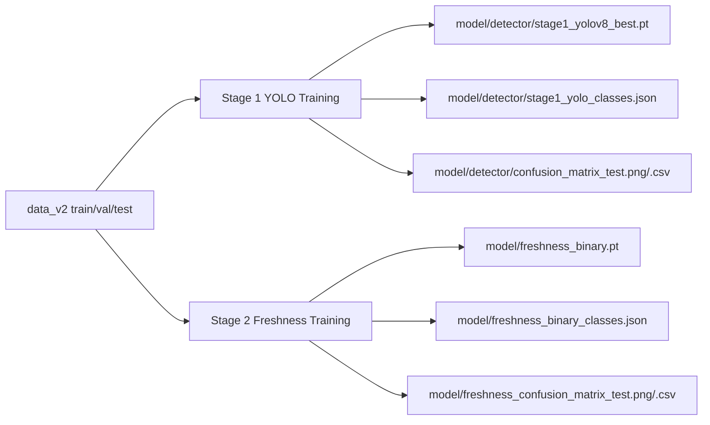
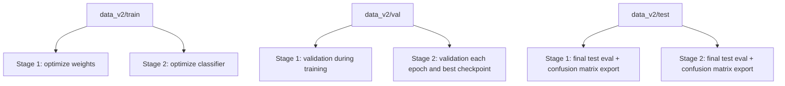

# FreshOrNot

FreshOrNot uses an offline two-stage inference pipeline for web and mobile:

1. Stage 1: produce detection with a pre-trained YOLO `.pt` detector.
2. Stage 2: freshness classification (`fresh` or `stale`) with a pre-trained PyTorch `.pt` model.

No runtime training is performed in the app.

## Architecture

- Frontend: React PWA (`frontend/`)
- Backend: FastAPI (`backend/app/main.py`)
- Inference artifacts loaded at startup:
  - `model/detector/stage1_yolov8_best.pt`
  - `model/detector/stage1_yolo_classes.json`
  - `model/freshness_binary.pt`
  - `model/freshness_binary_classes.json`

## Training

### Two-Stage Training Flow



### Train/Val/Test Usage



### Current Split Stats (`data_v2`)

| Split | Images | Approx Ratio |
| --- | ---: | ---: |
| `train` | 51,921 | 79.6% |
| `val` | 6,445 | 9.9% |
| `test` | 6,883 | 10.5% |
| `total` | 65,249 | 100% |

Both stages use the same split policy:

- `train`: optimize model weights
- `val`: in-training validation and model selection
- `test`: final unbiased evaluation and confusion-matrix export

### Stage 1: Detector (YOLO)

- Script: `train/train_stage1_detector_yolo.py`
- Reuses `data_v2` by converting it into YOLO format under `data_v2/yolo_stage1`.
- Trains and validates a YOLO model (Ultralytics), then runs test split evaluation.
- Output artifacts include:
  - `model/detector/stage1_yolov8_best.pt`
  - `model/detector/stage1_yolo_classes.json`
  - `model/detector/classes.names`

Command:

```bash
./.venv/bin/python train/train_stage1_detector_yolo.py --weights model/detector/yolov8n.pt --epochs 50
```

### Stage 2: Freshness Classifier

- Script: `train/train_stage2_freshness.py`
- Trains freshness binary classifier from `data_v2`.
- Output artifacts:
  - `model/freshness_binary.pt`
  - `model/freshness_binary_classes.json`

Command:

```bash
./.venv/bin/python train/train_stage2_freshness.py
```

### Training Launcher

Use the project launcher (recommended):

```bash
./scripts/start_training.sh --fast --mode all --stage1-device mps
```

### Profile Defaults

| Profile | Stage 1 Epochs | Stage 1 Img Size | Stage 1 Batch | Stage 2 Epochs | Stage 2 Img Size | Stage 2 Batch |
| --- | ---: | ---: | ---: | ---: | ---: | ---: |
| `full` | 50 | 640 | 16 | 8 | 224 | 32 |
| `fast` | 15 | 512 | 16 | 4 | 224 | 32 |

### Stage 1 Hyperparameters And Options

| Parameter | Default | Where Set | Override |
| --- | --- | --- | --- |
| Initial weights | `model/detector/yolov8n.pt` | `train/train_stage1_detector_yolo.py` | `--stage1-weights` |
| Epochs | `50` (`full`) / `15` (`fast`) | `scripts/start_training.sh` profile | `--stage1-epochs` |
| Image size | `640` (`full`) / `512` (`fast`) | `scripts/start_training.sh` profile | `--stage1-imgsz` |
| Batch size | `16` | `scripts/start_training.sh` profile | `--stage1-batch` |
| Device | `auto` (resolves to `cuda`/`mps`/`cpu`) | `scripts/start_training.sh` | `--stage1-device` |
| Dataloader workers | `4` | `scripts/start_training.sh` | `--stage1-workers` |
| Train fraction | `1.0` (use all train samples) | `scripts/start_training.sh` | `--stage1-fraction` |
| Fraction seed | `42` | `scripts/start_training.sh` | `--stage1-seed` |

### Stage 2 Hyperparameters And Options

| Parameter | Default | Where Set | Override |
| --- | --- | --- | --- |
| Epochs | `8` (`full`) / `4` (`fast`) | `scripts/start_training.sh` profile | `--stage2-epochs` or `STAGE2_EPOCHS` |
| Batch size | `32` | `scripts/start_training.sh` profile | `--stage2-batch` or `STAGE2_BATCH_SIZE` |
| Image size | `224` | `scripts/start_training.sh` profile | `--stage2-imgsz` or `STAGE2_IMG_SIZE` |
| Device | `auto` (resolves to `cuda`/`mps`/`cpu`) | `scripts/start_training.sh` | `--stage2-device` or `STAGE2_DEVICE` |
| Dataloader workers | `4` | `scripts/start_training.sh` | `--stage2-workers` or `STAGE2_WORKERS` |
| Train fraction | `1.0` (use all train samples) | `scripts/start_training.sh` | `--stage2-fraction` or `STAGE2_TRAIN_FRACTION` |
| Fraction seed | `42` | `scripts/start_training.sh` | `--stage2-seed` or `STAGE2_SEED` |
| Learning rate | `2e-4` | `train/train_stage2_freshness.py` | `STAGE2_LR` |
| Mosaic probability | `0.3` | `train/train_stage2_freshness.py` | `STAGE2_MOSAIC_PROB` |

### Training, Validation, And Test Outputs

| Stage | Train Split Use | Validation Split Use | Test Split Use | Fixed Export Artifacts |
| --- | --- | --- | --- | --- |
| Stage 1 (detector) | YOLO weight optimization | YOLO in-training validation | Post-training test eval | `model/detector/stage1_yolov8_best.pt`, `model/detector/confusion_matrix_test.png`, `model/detector/confusion_matrix_test.csv` |
| Stage 2 (freshness) | Classifier optimization | Per-epoch val + best checkpoint select | Final test eval | `model/freshness_binary.pt`, `model/freshness_confusion_matrix_test.png`, `model/freshness_confusion_matrix_test.csv` |

### Useful Commands

| Goal | Command |
| --- | --- |
| Full two-stage run | `./scripts/start_training.sh --full --mode all` |
| Fast two-stage run | `./scripts/start_training.sh --fast --mode all` |
| Stage 1 only on MPS | `./scripts/start_training.sh --fast --mode stage1 --stage1-device mps` |
| Better-quality under 2h target | `./scripts/start_training.sh --fast --mode all --stage1-device mps --stage1-fraction 0.4 --stage1-epochs 4 --stage1-imgsz 384 --stage1-batch 16 --stage2-epochs 2` |
| Faster stage-2 subset on MPS | `./scripts/start_training.sh --fast --mode stage2 --stage2-device mps --stage2-fraction 0.5 --stage2-epochs 2` |
| Stage 2 only | `./scripts/start_training.sh --fast --mode stage2` |
| Rebuild `data_v2` before training | `./scripts/start_training.sh --fast --mode all --prepare-data` |

### Latest Recorded Run Results: Fast Two-Stage (`stage1 mps + 0.4 fraction`, `stage2 epochs=2`)

Run profile/command used:

```bash
./scripts/start_training.sh --fast --mode all \
  --stage1-device mps \
  --stage1-fraction 0.4 \
  --stage1-epochs 4 \
  --stage1-imgsz 384 \
  --stage1-batch 16 \
  --stage2-epochs 2
```

#### Stage 1 (YOLO Detector) Metrics

| Split | Confusion Matrix Artifact | Precision | Recall | F1 Score | Notes |
| --- | --- | ---: | ---: | ---: | --- |
| Train | Not exported in current pipeline | N/A | N/A | N/A | Training losses are in `runs/detect/train2/results.csv` |
| Val | `runs/detect/val/confusion_matrix.png` | 0.9509 | 0.9284 | 0.9395 | Precision/Recall from final `results.csv` epoch (`4`); F1 computed from P/R |
| Test | `model/detector/confusion_matrix_test.csv`, `model/detector/confusion_matrix_test.png` | 0.9391 | 0.9391 | 0.9391 | Micro-average over produce classes (background excluded) |

Stage-1 test confusion matrix coverage:

| Metric | Value |
| --- | ---: |
| Correct diagonal (non-background classes) | 6459 |
| Total non-background samples | 6878 |
| Micro precision/recall/F1 | 0.9391 |

#### Stage 2 (Freshness Classifier) Metrics

| Split | Confusion Matrix Artifact | Precision | Recall | F1 Score | Notes |
| --- | --- | ---: | ---: | ---: | --- |
| Train | Not exported in current pipeline | N/A | N/A | N/A | Per-epoch train metrics are console-only in current script |
| Val | Not exported in current pipeline | N/A | N/A | N/A | Per-epoch val metrics are console-only in current script |
| Test | `model/freshness_confusion_matrix_test.csv`, `model/freshness_confusion_matrix_test.png` | 0.9718 (macro), 0.9695 (micro) | 0.9618 (macro), 0.9695 (micro) | 0.9665 (macro), 0.9695 (micro) | From saved binary confusion matrix |

Stage-2 test confusion matrix (counts):

| True \ Pred | Fresh | Stale |
| --- | ---: | ---: |
| Fresh | 4374 | 49 |
| Stale | 161 | 2299 |

## Data Layout

### `data/` and `data_v2/`

These local dataset folders are intentionally pruned from this checkout to keep the repo lean.

For training, restore raw data into `data/` and regenerate `data_v2/`.

Expected for training:

- `data_v2/train/fresh_<produce>/*`
- `data_v2/train/stale_<produce>/*`
- `data_v2/val/fresh_<produce>/*`
- `data_v2/val/stale_<produce>/*`

Build/refresh `data_v2`:

```bash
./.venv/bin/python scripts/prepare_data_v2.py
```

## Backend API

### `GET /api/health`

Returns detector/freshness readiness and resolved model paths.

### `POST /api/predict`

Input: image file (`multipart/form-data`, key `file`).

Output includes:

- `label` (`FRESH` or `STALE`)
- `produce`
- `confidence`
- `shelf_days`
- `pipeline.stage1` (detector details)
- `pipeline.stage2` (freshness details)

## Local Run

### One-Command Stack (Recommended)

```bash
./scripts/start_stack.sh
```

Useful options:

- `./scripts/start_stack.sh --backend-port 8001 --frontend-port 5174`
- `./scripts/start_stack.sh --skip-python-install --skip-node-install`

### Backend

```bash
cd backend
python -m venv .venv
source .venv/bin/activate
pip install -r requirements.txt
uvicorn app.main:app --host 0.0.0.0 --port 8000
```

### Frontend

```bash
cd frontend
npm install
npm run dev
```

Set `frontend/.env`:

```bash
VITE_API_BASE_URL=http://localhost:8000/api
```

## Notes

- This repo no longer uses the legacy single-stage training path.
- The app expects detector and freshness weights to be pre-trained and present before startup.
