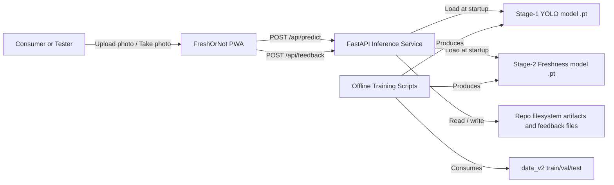
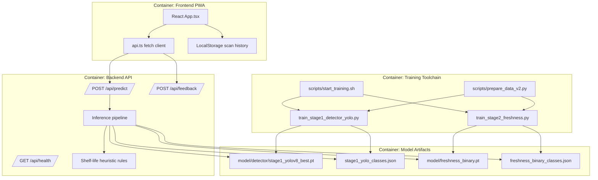
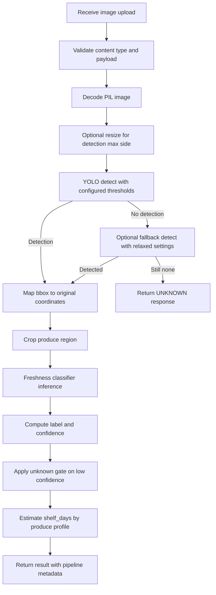
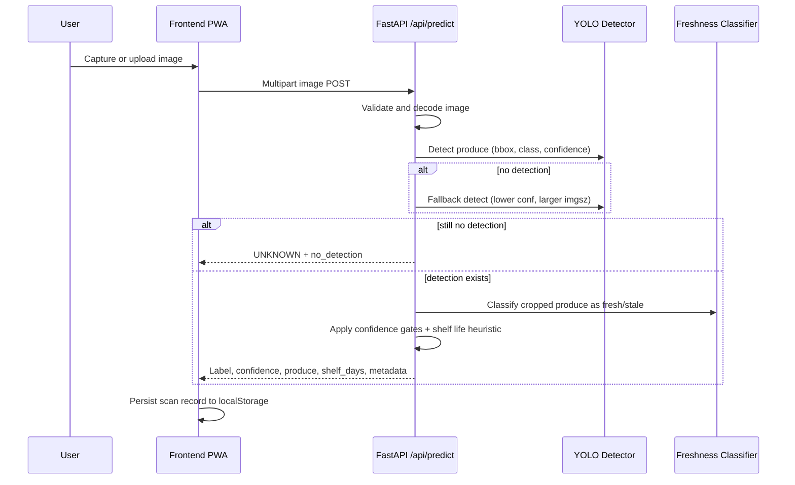
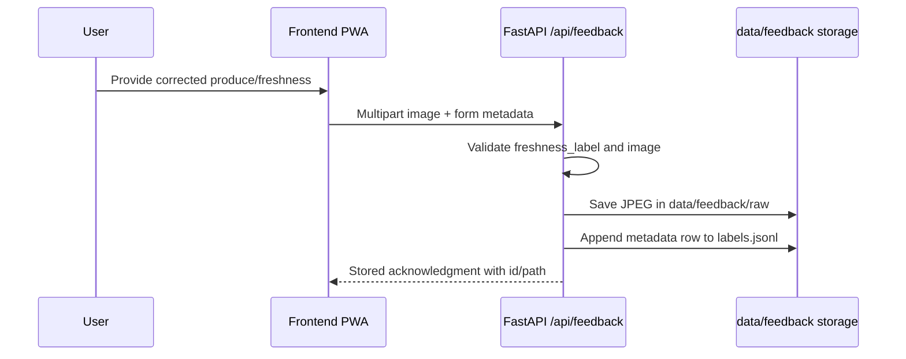
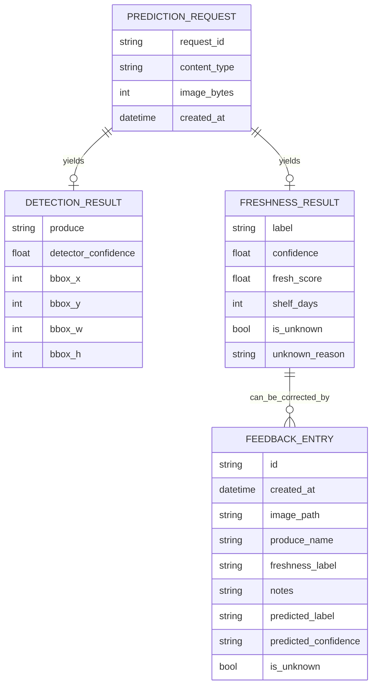

# FRESHOR_NOT Architecture Brief

## 1. Executive Summary

FRESHOR_NOT is a two-stage AI system that estimates produce freshness from a user image:

1. Stage 1 detects produce type and bounding box using YOLO.
2. Stage 2 classifies the crop as fresh or stale using a PyTorch classifier.

The product is implemented as:

- A React + Vite Progressive Web App for image capture and result display.
- A FastAPI backend that hosts inference models and APIs.
- Offline training pipelines that regenerate model artifacts from data_v2.

The architecture optimizes for practical mobile/web UX, deterministic local inference logic on server-side runtime, and reproducible model training with artifact-based deployment.

## 2. Business Context

### Problem

Users need quick quality assessment of fruits and vegetables, especially when visual judgment is uncertain. Existing manual assessment is inconsistent across users and conditions.

### Goals

- Provide near-real-time produce freshness prediction from a single image.
- Return clear action guidance (for example use urgently, monitor daily, discard now).
- Support unknown-produce fallback and data collection for model improvement.
- Keep runtime simple by using pre-trained artifacts and no online learning in production.

### Non-Goals

- Multi-object full-scene inventory counting.
- Training in the production API path.
- Fully autonomous shelf-life prediction beyond coarse profile heuristics.

## 3. System Context (C4 Level 1)

## 4. Container View (C4 Level 2)

## 5. Component View: Backend Inference Path

## 6. Key Runtime Flows

### 6.1 Predict Sequence

### 6.2 Feedback Sequence

## 7. Data Architecture

### 7.1 Training Data Layout

Primary dataset is organized under data_v2 with split-first hierarchy:

- data_v2/train
- data_v2/val
- data_v2/test

Each split contains folders like fresh_apple and stale_apple. Stage 1 collapses class names to produce categories for detection. Stage 2 collapses class names to binary labels (fresh or stale).

### 7.2 Inference-Time Data and Artifacts

- Detector artifact: model/detector/stage1_yolov8_best.pt
- Detector class mapping: model/detector/stage1_yolo_classes.json
- Classifier artifact: model/freshness_binary.pt
- Binary classes: model/freshness_binary_classes.json
- User feedback data:
  - data/feedback/raw/*.jpg
  - data/feedback/labels.jsonl

### 7.3 Logical Data Model

## 8. API Surface

### 8.1 GET /api/health

Purpose:

- Liveness and model-readiness endpoint.

Returns (high level):

- status
- detector_ready / detector_error
- freshness_ready / freshness_error
- resolved model file paths

### 8.2 POST /api/predict

Input:

- Multipart form with one image file.

Output:

- label: FRESH, STALE, or UNKNOWN
- confidence
- fresh_score
- shelf_days
- produce
- is_unknown and optional unknown_reason
- pipeline metadata for stage1 and stage2

Failure modes:

- 400 for invalid payload or non-image uploads.
- 503 when models are unavailable.

### 8.3 POST /api/feedback

Input:

- Multipart image + produce_name + freshness_label + optional notes and model prediction metadata.

Output:

- status stored, generated id, and relative image path.

Validation:

- freshness_label must be fresh or stale.

## 9. Deployment and Environments

### 9.1 Frontend Deployment

- Netlify builds frontend from the frontend directory.
- SPA fallback route redirects to index.html.
- /api/* is reverse proxied to backend Render URL.

### 9.2 Backend Deployment

- Render web service rooted at backend.
- Starts uvicorn app.main:app.
- Uses environment variables for model paths and CORS origins.

### 9.3 Runtime Configuration

Important backend tunables include:

- DETECTOR_CONF_THRESHOLD
- DETECTOR_NMS_THRESHOLD
- DETECTOR_IMGSZ
- DETECTOR_MAX_DET
- MAX_INPUT_SIDE
- FRESHNESS_UNKNOWN_THRESHOLD
- fallback detector settings

## 10. Training Architecture

### 10.1 Stage 1 Detector Training

- Converts data_v2 split data into YOLO dataset structure.
- Uses full-image bootstrap bounding boxes for single-produce images.
- Trains with Ultralytics YOLO and exports best.pt + confusion matrix artifacts.

### 10.2 Stage 2 Freshness Training

- Uses MobileNetV2 backbone with binary output head.
- Applies augmentation (crop, flips, jitter, affine, perspective, optional mosaic).
- Trains on train, selects by val, evaluates on test.

### 10.3 Training Orchestration

scripts/start_training.sh provides profile-based defaults:

- full profile for quality
- fast profile for shorter iteration loop

It supports stage-specific overrides for epochs, img size, batch, device, workers, and train fraction.

## 11. Quality Attributes

### Performance

- Detection pipeline includes optional pre-resize for large images.
- Fallback detector improves recall for difficult images at added latency.
- Typical response time is bounded by detector + classifier inference and image decode.

### Reliability

- Startup readiness checks ensure both models are loaded.
- Predict endpoint fails fast with explicit errors when model artifacts are missing.
- Feedback pipeline is append-only JSONL plus saved JPEGs.

### Maintainability

- Clear separation of concerns: frontend UX, backend inference, offline training.
- Model artifacts are versionable files, not hidden runtime state.
- Training scripts are independently executable and orchestrated by one launcher.

### Portability

- Local development on CPU/MPS/CUDA via auto device selection.
- Cloud deploy split across Netlify (frontend) and Render (backend).
- Colab notebook available for remote training execution and artifact export.

## 12. Security and Operational Considerations

Current controls:

- Input validation for image content type.
- CORS allowlist via environment variable.
- No shell execution in API routes.

Risks and improvements:

- Add file size limits and request timeouts to reduce abuse risk.
- Add rate limiting for public endpoints.
- Add structured auth if feedback endpoint should be restricted.
- Consider object storage for feedback images when volume grows.

## 13. Known Constraints and Tradeoffs

- Stage 1 assumes centered single-produce images during training bootstrap.
- Shelf-life estimation is heuristic and produce-profile based.
- Unknown detection combines detector and classifier confidence thresholds, which may require per-produce calibration.
- Feedback is stored locally and not yet integrated into automated retraining pipeline.

## 14. Suggested Roadmap

1. Add model/artifact version manifest and expose model version in health and predict responses.
2. Add experiment tracking for stage 1 and stage 2 metrics over time.
3. Add periodic feedback curation and semi-automated retraining loop.
4. Add API-level rate limiting and payload size guards.
5. Add calibrated confidence reporting and threshold tuning per produce class.

## 15. Repository Mapping

- Frontend app and UI flow: frontend/src/App.tsx, frontend/src/api.ts
- Backend API and inference: backend/app/main.py
- Frontend deployment config: netlify.toml
- Backend deployment config: render.yaml
- Stage 1 training: train/train_stage1_detector_yolo.py
- Stage 2 training: train/train_stage2_freshness.py
- Training orchestrator: scripts/start_training.sh

## 16. Architecture Decision Snapshot

### Decision A: Two-stage inference instead of single end-to-end classifier

Status: Accepted

Rationale:

- Separates produce identity from freshness signal.
- Allows produce-specific shelf-life heuristics.
- Enables independent retraining of detection and freshness stages.

Consequence:

- Additional latency and complexity versus one-model pipeline.

### Decision B: Artifact-based model loading at startup

Status: Accepted

Rationale:

- Predictable deployment behavior and no training-time dependency in runtime path.

Consequence:

- Requires explicit artifact management and path configuration.

### Decision C: Local feedback JSONL storage in repo path

Status: Accepted (interim)

Rationale:

- Fastest implementation for collecting unknown/corrective examples.

Consequence:

- Not ideal for scale, multi-instance deployments, or analytics querying.

---

Generated for repository: FRESHOR_NOT
Date: 2026-03-10
